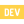

### Hi, I'm Pearce Allen👋

[][gmail]
[][linkedin]
<!-- [][twitter] -->
<!-- [][medium] -->
<!-- [][devto] -->

<!--
**pearcepallen/pearcepallen** is a ✨ _special_ ✨ repository because its `README.md` (this file) appears on your GitHub profile.

Here are some ideas to get you started:

- 🔭 I’m currently working on ...
- 🌱 I’m currently learning ...
- 👯 I’m looking to collaborate on ...
- 🤔 I’m looking for help with ...
- 💬 Ask me about ...
- 📫 How to reach me: pearce
-  ...
- 😄 Pronouns: ...
- ⚡ Fun fact: ...
-->

[gmail]: mailto:pearce.p.allen@gmail.com
[linkedin]: https://www.linkedin.com/in/pearce-allen-bb51a01aa/
<!-- [twitter]: https://www.twitter.com/itsmetherogue/ -->
<!-- [medium]: https://tassiaaccioly.medium.com/ -->
<!-- [devto]: https://dev.to/tassiaaccioly -->
